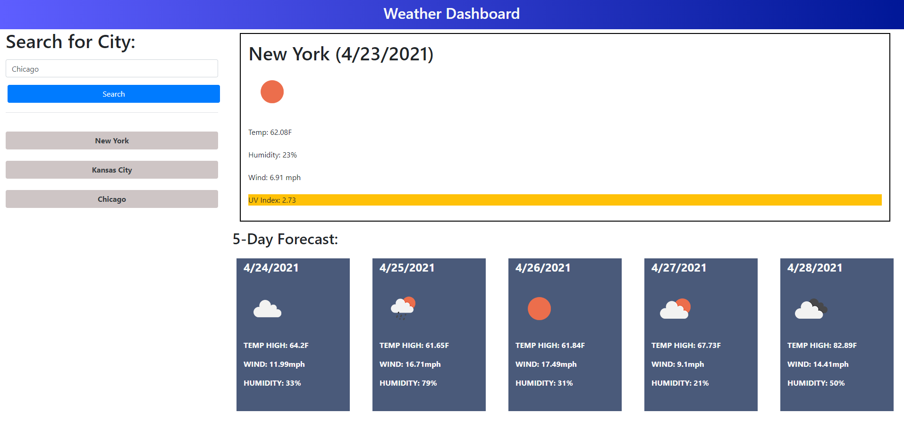

# Weather-Dashboard
Gets weather from multiple cities and displays info for the user based on their city selecitons.

This page accepts input from the user in the form of City, then looks up the city and displays the current day conditions, and the 5-day forecast for that city. Each search will also create a new "recent" button which will post to the page and then also function as a search when clicked. These buttons will be saved in localstorage and can be cleared by clicking the nav link at the top of the page.

## Installation

The deployed website can be accessed at the below link.
 
https://btdubbzzz.github.io/Weather-Dashboard/#

>Screenshot

## Process / What I learned

For this project I learned about fetch calls and I even dived into learning more about async functions and the await keyword. I learned to maniuplate and use the data being brought in from server-side APIs. I also got more work with bootstrap and JQuery and I feel that this is my best looking and most polished app yet. There are many improvements I would make that I will detail below but overall I am super pleased with this project.

## What I would fix

The folowing is a short list of potential fixes if I had time to continue this project

1. Figure out how to trim the background color of the UV index (probably just a padding or margin problem but haven't had time to look into it yet)
2. Avoid duplicate buttons
3. Create an overflow container for the recent buttons if there gets to be too many ie scroll bar. (I tried this but could not get it working, so I need to read up more on the subject)
4. Add another API call that does all the same things but allows you to input the State with the City
5. Get the enter button working for form submission
6. Make it mobile responsive

## Meta

Blake Wright – [My GitHub](https://github.com/BTDubbzzz) – wright.blake.t@gmail.com

## Contributing

1. JQuery
2. Bootstrap
3. DayJS
4. openWeatherMap API
